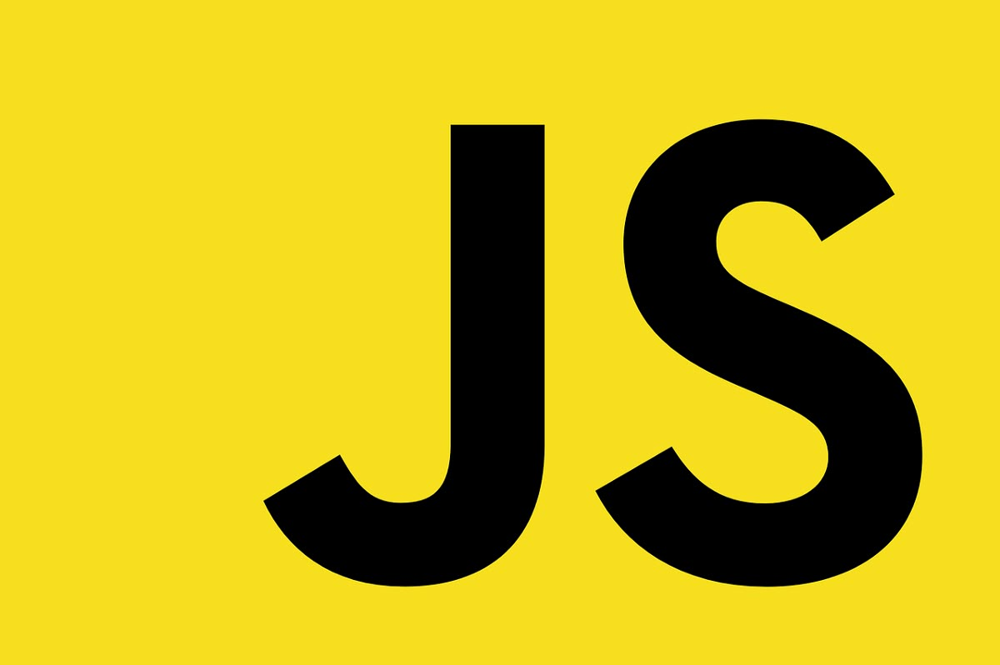

## JavaScript Projects Demo

Este repositorio contiene diferentes proyectos y ejercicios desarrollados con **JavaScript**, creados como parte de mi proceso de **aprendizaje, práctica y fortalecimiento** de fundamentos en programación frontend.

Los proyectos están enfocados en aplicar conceptos esenciales del lenguaje, manipulación del DOM y desarrollo web sin frameworks externos.

---

## Información técnica

Cada práctica o aplicación se encuentra organizada en su propia carpeta dentro del repositorio:

- JavaScript/proyecto1  
- JavaScript/proyecto2  
- JavaScript/proyecto3  
*(Los nombres pueden variar según el contenido y el enfoque del ejercicio.)*

Cada proyecto incluye temas como:
- Variables, funciones y estructuras de control  
- Manipulación del DOM  
- Eventos y formularios  
- Programación orientada a objetos (POO)  
- Consumo de APIs con `fetch`  
- Asincronía (`async/await`)  
- LocalStorage / SessionStorage  
- Algoritmos y estructuras de datos  

---

## Objetivo

Este repositorio tiene como meta documentar mi progreso y dominio del lenguaje **JavaScript puro (Vanilla JS)**, sirviendo como base para proyectos más avanzados en frameworks como **React** y **Angular**.

> En futuras versiones se incluirá un flujo de despliegue automático mediante **GitHub Actions** y **GitHub Pages**.

---

## Tecnologías utilizadas
- JavaScript (ES6+)
- HTML5 / CSS3
- Bootstrap 5
- GitHub Pages *(pendiente de integración)*
- GitHub Actions *(planificado)*

---

## Licencia
Este proyecto es de uso educativo y demostrativo.  
© 2025 [George Mota](https://github.com/georgemota)
